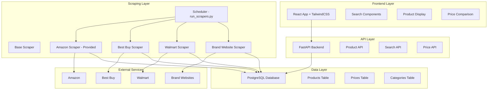

# Design Document

## Overview

PricePilot is a modern price comparison platform built with a React frontend, FastAPI backend, and PostgreSQL database. The system uses automated web scrapers to collect pricing data from Amazon, Best Buy, Walmart, and brand websites, providing users with real-time price comparisons for high-ticket tech items. The architecture emphasizes modularity, scalability, and maintainability while delivering a premium user experience inspired by modern SaaS design patterns.

## Architecture

### System Architecture



### Technology Stack

- **Frontend**: React 18+ with TypeScript, TailwindCSS, Vite for build tooling
- **Backend**: FastAPI with Python 3.9+, Pydantic for data validation
- **Database**: PostgreSQL with SQLAlchemy ORM and Alembic for migrations
- **Scraping**: Python with aiohttp for async requests, BeautifulSoup4 for parsing
- **Scheduling**: Cron jobs executing run_scrapers.py script
- **Development**: Docker for containerization, pytest for testing

## Components and Interfaces

### Frontend Components

#### Page Components
- **HomePage**: Hero section, category grid, featured deals, vendor showcase
- **CategoryPage**: Product grid with filtering, sorting, and pagination
- **ProductPage**: Price comparison table, product details, similar products
- **SearchResultsPage**: Search results with filters and sorting options

#### Shared Components
- **SearchBar**: Autocomplete input with fuzzy matching and suggestions
- **ProductCard**: Reusable card showing product image, name, price, and best deal badge
- **PriceTable**: Comparison table with vendor logos, prices, discounts, and CTAs
- **SimilarProducts**: Horizontal scrollable list of related products
- **LoadingStates**: Skeleton loaders and loading spinners
- **ErrorBoundary**: Error handling and fallback UI components

#### UI Components
- **Button**: Pill-style buttons with hover effects
- **Card**: Floating cards with soft shadows
- **Badge**: "Best Deal" and category badges
- **Tooltip**: Price freshness and additional information
- **Modal**: Product details and comparison overlays

### Backend API Design

#### Core API Endpoints

```python
# Product endpoints
GET /api/products/search?q={query}&limit={limit}
GET /api/products/category/{category}?page={page}&sort={sort}
GET /api/products/{product_id}
GET /api/products/{product_id}/similar
GET /api/products/{product_id}/prices

# Category endpoints
GET /api/categories
GET /api/categories/{category}/popular

# Search endpoints
GET /api/search/autocomplete?q={query}
GET /api/search/suggestions?q={query}

# System endpoints
GET /api/health
GET /api/scraper/status
GET /api/scraper/last-run
```

#### API Response Models

```python
class ProductResponse(BaseModel):
    id: str
    name: str
    brand: str
    category: str
    image_url: Optional[str]
    lowest_price: Decimal
    best_deal_vendor: str
    last_updated: datetime

class PriceComparison(BaseModel):
    vendor: str
    price: Decimal
    original_price: Optional[Decimal]
    discount_percentage: Optional[float]
    stock_status: str
    product_url: str
    last_updated: datetime

class SimilarProduct(BaseModel):
    id: str
    name: str
    image_url: Optional[str]
    lowest_price: Decimal
    similarity_score: float
```

### Scraper Architecture

#### Base Scraper Interface

```python
from abc import ABC, abstractmethod
from typing import List, Optional
from dataclasses import dataclass

@dataclass
class ScrapedProduct:
    name: str
    price: Decimal
    original_price: Optional[Decimal]
    stock_status: str
    product_url: str
    image_url: Optional[str]
    variations: List[dict]

class BaseScraper(ABC):
    def __init__(self, config: dict):
        self.config = config
        self.session = aiohttp.ClientSession()
    
    @abstractmethod
    async def search_product(self, query: str) -> List[ScrapedProduct]:
        pass
    
    @abstractmethod
    async def get_product_details(self, product_url: str) -> ScrapedProduct:
        pass
    
    def normalize_price(self, price_text: str) -> Decimal:
        # Common price normalization logic
        pass
    
    def extract_best_variation(self, variations: List[dict]) -> dict:
        # Logic to find lowest priced variation
        pass
```

#### Specialized Scrapers

```python
class AmazonScraper(BaseScraper):
    # Built on provided SeleniumFetcher from amazon_scrape_demo.py
    # Preserves existing stealth capabilities and browser simulation
    def __init__(self, config: dict):
        super().__init__(config)
        # Import and use existing SeleniumFetcher class from amazon_scrape_demo.py
        from .amazon_scrape_demo import SeleniumFetcher
        self.selenium_fetcher = SeleniumFetcher(is_headless=config.get('headless', True))
        # Use existing initialize_human_browser_history() for stealth
        self.selenium_fetcher.initialize_human_browser_history()
    
    async def search_product(self, query: str) -> List[ScrapedProduct]:
        # Use existing selenium_fetcher.fetch() method (preserving all stealth logic)
        search_url = f"https://www.amazon.com/s?k={query.replace(' ', '+')}"
        html = self.selenium_fetcher.fetch(search_url, verbose=True, return_content=True)
        
        # Parse HTML using BeautifulSoup to extract product listings
        # Extract: product name, price, image URL, product URL from search results
        # Handle Amazon's search result structure and sponsored listings
        # Return list of ScrapedProduct objects with normalized data
        pass
    
    async def get_product_details(self, product_url: str) -> ScrapedProduct:
        # Use existing selenium_fetcher.fetch() method (preserving stealth)
        html = self.selenium_fetcher.fetch(product_url, verbose=True, return_content=True)
        
        # Use existing extract_document_text() for text content extraction
        from .amazon_scrape_demo import extract_document_text
        text_content = extract_document_text(self.selenium_fetcher)
        
        # Parse detailed product information from Amazon product page
        # Extract: detailed pricing, product variations, stock status, specifications
        # Handle Amazon's complex variation system (color, size, model options)
        # Return single ScrapedProduct with best variation pricing
        pass
    
    def extract_price_from_text(self, text: str) -> Optional[Decimal]:
        # Parse Amazon price formats: $123.45, $1,234.56, Price: $999.99
        # Handle various Amazon price displays: "List Price", "Our Price", etc.
        # Use regex to extract numeric price values from text content
        import re
        from decimal import Decimal
        
        # Amazon price patterns
        price_patterns = [
            r'\$([0-9,]+\.?[0-9]*)',  # $123.45 or $1,234
            r'Price:?\s*\$([0-9,]+\.?[0-9]*)',  # Price: $123.45
            r'([0-9,]+\.?[0-9]*)\s*dollars?',  # 123.45 dollars
        ]
        
        for pattern in price_patterns:
            match = re.search(pattern, text, re.IGNORECASE)
            if match:
                price_str = match.group(1).replace(',', '')
                try:
                    return Decimal(price_str)
                except:
                    continue
        return None
    
    def quit_selenium(self):
        # Use existing quit_selenium() function to clean shutdown
        if self.selenium_fetcher:
            self.selenium_fetcher.quit()

class BestBuyScraper(BaseScraper):
    async def search_product(self, query: str) -> List[ScrapedProduct]:
        # Best Buy specific search implementation
        # Uses Best Buy's search API or web scraping
        pass

class WalmartScraper(BaseScraper):
    async def search_product(self, query: str) -> List[ScrapedProduct]:
        # Walmart specific search implementation
        # Uses Walmart's API or web scraping
        pass

class BrandScraper(BaseScraper):
    async def search_product(self, query: str) -> List[ScrapedProduct]:
        # Flexible scraper with configurable selectors
        # Adapts to different brand website structures
        pass
```

## Data Models

### Database Schema

```sql
-- Categories table
CREATE TABLE categories (
    id UUID PRIMARY KEY DEFAULT gen_random_uuid(),
    name VARCHAR(50) UNIQUE NOT NULL,
    display_name VARCHAR(100) NOT NULL,
    description TEXT,
    image_url VARCHAR(500),
    created_at TIMESTAMP DEFAULT NOW()
);

-- Products table
CREATE TABLE products (
    id UUID PRIMARY KEY DEFAULT gen_random_uuid(),
    name VARCHAR(255) NOT NULL,
    brand VARCHAR(100),
    model VARCHAR(100),
    category_id UUID REFERENCES categories(id),
    description TEXT,
    image_url VARCHAR(500),
    specifications JSONB,
    popularity_score INTEGER DEFAULT 0,
    created_at TIMESTAMP DEFAULT NOW(),
    updated_at TIMESTAMP DEFAULT NOW()
);

-- Vendors table
CREATE TABLE vendors (
    id UUID PRIMARY KEY DEFAULT gen_random_uuid(),
    name VARCHAR(50) UNIQUE NOT NULL,
    display_name VARCHAR(100) NOT NULL,
    logo_url VARCHAR(500),
    base_url VARCHAR(255),
    is_active BOOLEAN DEFAULT true,
    scraper_config JSONB,
    created_at TIMESTAMP DEFAULT NOW()
);

-- Prices table
CREATE TABLE prices (
    id UUID PRIMARY KEY DEFAULT gen_random_uuid(),
    product_id UUID REFERENCES products(id) ON DELETE CASCADE,
    vendor_id UUID REFERENCES vendors(id),
    price DECIMAL(10,2) NOT NULL,
    original_price DECIMAL(10,2),
    discount_percentage FLOAT,
    stock_status VARCHAR(20) DEFAULT 'in_stock',
    product_url VARCHAR(500) NOT NULL,
    variation_details JSONB,
    last_updated_at TIMESTAMP DEFAULT NOW(),
    created_at TIMESTAMP DEFAULT NOW(),
    UNIQUE(product_id, vendor_id)
);

-- Scraper runs table for monitoring
CREATE TABLE scraper_runs (
    id UUID PRIMARY KEY DEFAULT gen_random_uuid(),
    vendor_id UUID REFERENCES vendors(id),
    status VARCHAR(20) NOT NULL,
    products_scraped INTEGER DEFAULT 0,
    errors_count INTEGER DEFAULT 0,
    duration_seconds INTEGER,
    error_details JSONB,
    started_at TIMESTAMP DEFAULT NOW(),
    completed_at TIMESTAMP
);

-- Indexes for performance
CREATE INDEX idx_products_category ON products(category_id);
CREATE INDEX idx_products_brand ON products(brand);
CREATE INDEX idx_products_popularity ON products(popularity_score DESC);
CREATE INDEX idx_prices_product_vendor ON prices(product_id, vendor_id);
CREATE INDEX idx_prices_updated_at ON prices(last_updated_at DESC);
CREATE INDEX idx_prices_price ON prices(price);
```

### SQLAlchemy Models

```python
class Category(Base):
    __tablename__ = "categories"
    
    id = Column(UUID, primary_key=True, default=uuid4)
    name = Column(String(50), unique=True, nullable=False)
    display_name = Column(String(100), nullable=False)
    description = Column(Text)
    image_url = Column(String(500))
    created_at = Column(DateTime, default=datetime.utcnow)
    
    products = relationship("Product", back_populates="category")

class Product(Base):
    __tablename__ = "products"
    
    id = Column(UUID, primary_key=True, default=uuid4)
    name = Column(String(255), nullable=False)
    brand = Column(String(100))
    model = Column(String(100))
    category_id = Column(UUID, ForeignKey("categories.id"))
    description = Column(Text)
    image_url = Column(String(500))
    specifications = Column(JSON)
    popularity_score = Column(Integer, default=0)
    created_at = Column(DateTime, default=datetime.utcnow)
    updated_at = Column(DateTime, default=datetime.utcnow, onupdate=datetime.utcnow)
    
    category = relationship("Category", back_populates="products")
    prices = relationship("Price", back_populates="product", cascade="all, delete-orphan")
```

## Error Handling

### Scraper Error Handling Strategy

```python
class ScraperErrorHandler:
    def __init__(self, max_retries: int = 3):
        self.max_retries = max_retries
    
    async def handle_request_error(self, error: Exception, attempt: int):
        if attempt < self.max_retries:
            delay = 2 ** attempt  # Exponential backoff
            await asyncio.sleep(delay)
            return True  # Retry
        return False  # Give up
    
    def handle_parsing_error(self, error: Exception, product_data: dict):
        logger.error(f"Parsing error for product: {error}")
        # Continue with next product, don't fail entire scrape
        return None
    
    def handle_rate_limit(self, response_headers: dict):
        retry_after = response_headers.get('Retry-After', 60)
        return int(retry_after)
```

### API Error Responses

```python
class ErrorResponse(BaseModel):
    error: str
    message: str
    details: Optional[dict] = None
    timestamp: datetime = Field(default_factory=datetime.utcnow)

# Example error responses
{
    "error": "PRODUCT_NOT_FOUND",
    "message": "Product with ID 'xyz' not found",
    "details": {"suggested_products": [...]},
    "timestamp": "2024-01-15T10:30:00Z"
}
```

## Testing Strategy

### Unit Testing Approach

```python
# Test scraper functionality
@pytest.mark.asyncio
async def test_amazon_scraper_search():
    scraper = AmazonScraper(config={})
    products = await scraper.search_product("MacBook Pro")
    assert len(products) > 0
    assert all(p.price > 0 for p in products)

# Test API endpoints
def test_search_products_endpoint(client):
    response = client.get("/api/products/search?q=laptop")
    assert response.status_code == 200
    assert len(response.json()["products"]) > 0

# Test price comparison logic
def test_price_comparison_highlighting():
    prices = [
        {"vendor": "Amazon", "price": 999.99},
        {"vendor": "Best Buy", "price": 1099.99},
        {"vendor": "Walmart", "price": 949.99}
    ]
    result = highlight_best_price(prices)
    assert result[2]["is_best_price"] == True
```

### Integration Testing

```python
@pytest.mark.integration
async def test_full_scraping_pipeline():
    # Test complete flow from scraping to database storage
    scraper = AmazonScraper(config={})
    products = await scraper.search_product("iPhone 15")
    
    # Store in database
    for product_data in products:
        product = await store_product(product_data)
        assert product.id is not None
        
    # Verify API returns the data
    response = client.get(f"/api/products/{product.id}")
    assert response.status_code == 200
```

## Security Considerations

### Scraping Ethics and Compliance

```python
class ScrapingEthicsManager:
    def __init__(self):
        self.robots_cache = {}
        self.rate_limits = {
            "amazon": 1.0,  # 1 second between requests
            "bestbuy": 0.5,
            "walmart": 0.5,
            "brand": 2.0    # More conservative for brand sites
        }
    
    async def check_robots_txt(self, domain: str) -> bool:
        if domain not in self.robots_cache:
            robots_url = f"https://{domain}/robots.txt"
            # Check if scraping is allowed
            self.robots_cache[domain] = await self._parse_robots(robots_url)
        return self.robots_cache[domain]
    
    async def respect_rate_limit(self, vendor: str):
        delay = self.rate_limits.get(vendor, 1.0)
        await asyncio.sleep(delay)
```

### Data Security

- **Input Validation**: All user inputs sanitized using Pydantic models
- **SQL Injection Prevention**: SQLAlchemy ORM with parameterized queries
- **XSS Protection**: React's built-in XSS protection + content sanitization
- **CORS Configuration**: Restricted origins in production environment
- **Environment Variables**: Sensitive configuration stored securely

## Performance Optimization

### Frontend Performance

```javascript
// Code splitting for better load times
const CategoryPage = lazy(() => import('./pages/CategoryPage'));
const ProductPage = lazy(() => import('./pages/ProductPage'));

// Image optimization
const OptimizedImage = ({ src, alt, ...props }) => (
  
);

// Search debouncing
const useDebounce = (value, delay) => {
  const [debouncedValue, setDebouncedValue] = useState(value);
  
  useEffect(() => {
    const handler = setTimeout(() => {
      setDebouncedValue(value);
    }, delay);
    
    return () => clearTimeout(handler);
  }, [value, delay]);
  
  return debouncedValue;
};
```

### Backend Performance

```python
# Database query optimization
async def get_products_with_prices(category: str, limit: int = 20):
    query = (
        select(Product, Price)
        .join(Price, Product.id == Price.product_id)
        .where(Product.category == category)
        .options(selectinload(Product.prices))
        .limit(limit)
    )
    return await session.execute(query)

# Caching frequently accessed data
@lru_cache(maxsize=100)
def get_popular_products(category: str):
    return session.query(Product).filter(
        Product.category == category
    ).order_by(Product.popularity_score.desc()).limit(10).all()
```

### Scraper Performance

```python
# Concurrent scraping with controlled concurrency
async def scrape_products_concurrently(product_queries: List[str]):
    semaphore = asyncio.Semaphore(5)  # Max 5 concurrent requests
    
    async def scrape_with_semaphore(query):
        async with semaphore:
            return await scraper.search_product(query)
    
    tasks = [scrape_with_semaphore(query) for query in product_queries]
    results = await asyncio.gather(*tasks, return_exceptions=True)
    return results
```